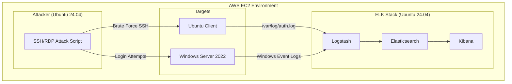

### Detection-ELK

### Objectives

This project addresses the challenge of detecting SSH brute-force attacks and abnormal system activity across Linux and Windows systems by centralizing and analysing security logs with an ELK-based SIEM to enable real-time threat detection.

Tools used
- AWS EC2
  - Elasticsearch, Log Stach, Kibana - ELK on Ubuntu 24.04 
  - Ubuntu 24.04 Client
  - Window 2022
  - Ubuntu 24.04 attacker
    
### Architecture

ELK Installation
