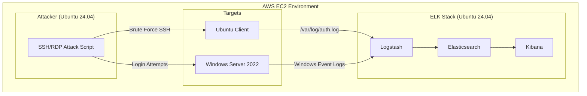

### Detection-ELK

#### Introduction
The ELK stack, Elasticsearch, Logstash, and Kibana, is a widely used solution for collecting, processing, and analyzing log data in real time. It enables security teams to centralize logs from multiple systems and quickly identify suspicious activity.

In this project, simulated SSH brute-force attacks are launched from an attacker machine against both Linux and Windows targets. The resulting logs are collected and processed through the ELK stack, allowing detection of unauthorized access attempts.

#### Objectives

This project addresses the challenge of detecting SSH brute-force attacks and abnormal system activity across Linux and Windows systems by centralizing and analysing security logs with an ELK-based SIEM to enable real-time threat detection.

#### Tools used
- *AWS EC2*
  - Elasticsearch, Log Stach, Kibana - ELK on Ubuntu 24.04 
  - Ubuntu 24.04 (Client)
  - Window 2022 (Client)
  - Ubuntu 24.04 (Attacker)
    
#### Architecture

*A simulation of an SSH/ RDP brute-force attack against Linux and Windows systems, with logs ingested and analyzed using the ELK stack for detection and visualization.*


#### ELK Installation
Log in to the EC2 instance using the SSH keys created in the deployment stage
Use the command:

```
ssh -i <name of SSH key.pem> ubuntu@<public IP address of instance>
```

Step 1: Update & Upgrade Packages

Update the package index and upgrade installed packages

```
sudo apt update && sudo apt upgrade -y
```

Step 2: Install Java

Java handles things like memory management, indexing performance, and query execution.

```
sudo apt install openjdk-17-jdk -y

```


Step 3: 

Import the Elastic GPG signing key: for trust and package verification

```
curl -fsSL https://artifacts.elastic.co/GPG-KEY-elasticsearch | sudo gpg --dearmor -o /usr/share/keyrings/elasticsearch-keyring.gpg
```

  - curl -fsSL ... → downloads Elastic’s GPG public signing key
  - gpg --dearmor → converts it into a binary format that APT understands
  - -o /usr/share/keyrings/... → stores the key in a trusted keyring location on your system

Add the Elastic 8.x APT repository on the system

```
echo "deb [signed-by=/usr/share/keyrings/elasticsearch-keyring.gpg] https://artifacts.elastic.co/packages/8.x/apt stable main" | sudo tee /etc/apt/sources.list.d/elastic-8.x.list
```
  - echo "deb ..." → defines a new APT repository (Elastic’s official package source)
  - signed-by=... → tells APT to only trust packages signed with the GPG key added earlier
  - tee /etc/apt/sources.list.d/... → writes this repo into a new sources list file (with sudo permissions)

Step 4: Update the repository and install Elasticsearch

```
sudo apt update
sudo apt install -y elasticsearch
```


Enable and verify that Elasticsearch is running. "enable elasticsearch" ensures the service runs if and when the server is rebooted
```
sudo systemctl enable elasticsearch.service

sudo systemctl status elasticsearch
```
Purpose:

*Elasticsearch → stores and indexes logs for fast searching.*


Step 5: Install, enable, start and verify Logstash is running

```
sudo apt install logstash -y

sudo systemctl enable logstash

sudo systemctl start logstash

sudo systemctl status logstash 
```
Purpose:

*Logstash → processes and forwards logs into Elasticsearch.*


Step 6: Repeat step 5 for Kibana

```
sudo apt install kibana -y

sudo systemctl enable kibana

sudo systemctl start kibana

sudo systemctl status kibana 
```
Purpose:

*Kibana → allows inspection of logs and investigation of events (e.g. failed SSH logins)*


#### ELK Configuration

Step 7: Configure Elasticsearch
Edit the file elasticsearch.yml to listen to all network interfaces.
Restart the Elasticsearch service for the changes to take effect

```
vi elasticsearch.yml: use IP address 0.0.0.0

sudo systemctl restart elasticsearch

sudo systemctl status elasticsearch
```
Note: Using the IP address 0.0.0.0 should not be used in a production environment. Restrict the IP address to private only.

Step 8: Generate Encryption Keys.

3 keys will be generated. This command generates encryption keys used by Kibana to protect authentication data, saved objects, and reporting data at rest.

Navigate to /usr/share/kibana/bin
```
cd /usr/share/kibana/bin
./kibana-encryption-keys generate
```


Step 9: Add the keys to the keystore

```
.kibana-keystore add xpack.security.encryptionKey

.kibana-keystore add xpack.reporting.encryptionKey

.kibana-keystore add xpack.encryptedSavedObjects. encryptionKey

```
Step 10: Allow port 9200 and port 5601 through the firewall 

```
ufw allow 9200/tcp

ufw allow 5601/tcp
```

Step 11: Reset Kibana and Elastic passwords

```
/usr/share/elasticsearch/bin/elasticsearch-reset-password -u kibana_system

/usr/share/elasticsearch/bin/elasticsearch-reset-password -u elastic
```


Step 12: Generating Enrollment Token and Verification Code.

Generate a temporary enrollment token used to securely connect Kibana or additional nodes to an Elasticsearch cluster during initial setup.

```
cd /usr/share/elasticsearch/bin
./elasticsearch-create-enrollment-token

```


The Kibana verification code is a one-time code used during initial setup to confirm Kibana is running and securely connected to Elasticsearch.
```
cd /usr/share/kibana/bin
./kibana-verfication-code
```


