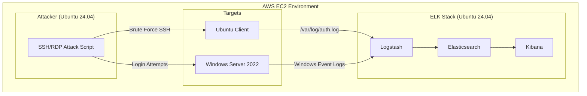

### Detection-ELK

#### Introduction
The ELK stack—Elasticsearch, Logstash, and Kibana—is a widely used solution for collecting, processing, and analyzing log data in real time. It enables security teams to centralize logs from multiple systems and quickly identify suspicious activity.

In this project, simulated SSH brute-force attacks are launched from an attacker machine against both Linux and Windows targets. The resulting logs are collected and processed through the ELK stack, allowing detection of unauthorized access attempts.

#### Objectives

This project addresses the challenge of detecting SSH brute-force attacks and abnormal system activity across Linux and Windows systems by centralizing and analysing security logs with an ELK-based SIEM to enable real-time threat detection.

#### Tools used
- *AWS EC2*
  - Elasticsearch, Log Stach, Kibana - ELK on Ubuntu 24.04 
  - Ubuntu 24.04 (Client)
  - Window 2022 (Client)
  - Ubuntu 24.04 (Attacker)
    
#### Architecture

*A simulation of an SSH/ RDP brute-force attacks against Linux and Windows systems, with logs ingested and analyzed using the ELK stack for detection and visualization.*


#### ELK Installation

Step 1: Update System


Step 2: Install Java

Java handles things like memory management, indexing performance, and query execution.

```
sudo apt install openjdk-17-jdk -y

```


